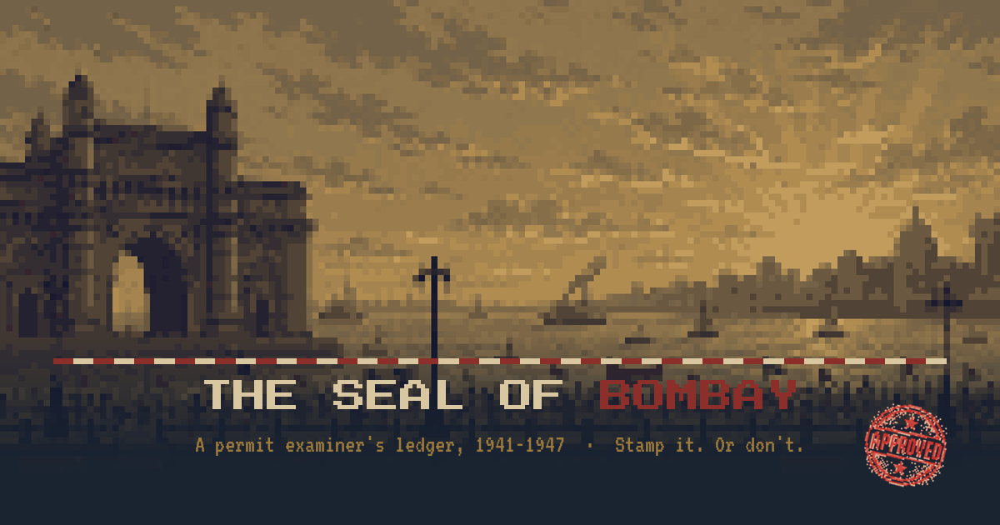

# The Seal of Bombay

**A permit examiner's ledger, 1941–1947.**

Play it: **[seal-of-bombay.vercel.app](https://seal-of-bombay.vercel.app)** — best on desktop, keyboard shortcuts included.



## Why this exists

Replayed *Papers, Please* recently and couldn't stop thinking about how much weight one small stamp can carry — choice after choice, consequence after consequence. Wondered how that would feel dropped into 1940s India. So it got built.

You're Keshav Damle, Permit Examiner Grade III, at a checkpost desk in Bombay. A stool, a stamp, and a rulebook. Check the seal. Check the date. Check the face. Every stamp is a choice, and the ledger never forgets — across 12 pivotal days spanning seven years (1941–1947), toward one of **6 endings** shaped entirely by what you chose to approve, deny, detain, or let slide for a price.

Mostly this was built to see what people actually do when the stamp is theirs.

## How it plays

- **Stamp actions**: Approve, Deny, Detain, or (when one's on the table) take the Bribe — each with a keyboard shortcut (`A` / `D` / `T` / `B`).
- **Five meters** track the fallout of every decision: Household, Crown, Movement, Conscience, Suspicion. Let Suspicion run out and the ledger closes on you instead.
- **Consequences carry forward.** Entrants, colleagues, and choices from earlier days resurface later — nothing you stamp is really forgotten.
- There's more tucked into this build than the surface shows. If you go looking, you might find it.

## Tech stack

- [React 19](https://react.dev/) + [TypeScript](https://www.typescriptlang.org/) + [Vite 7](https://vite.dev/)
- [Tailwind CSS](https://tailwindcss.com/) with a hand-rolled pixel/brass UI kit (`PixelButton`, `KeyHint`, the `.hard` panel style)
- [react-router](https://reactrouter.com/) for screen flow, [Radix UI](https://www.radix-ui.com/) primitives under the shadcn-style component set
- [Vercel Web Analytics](https://vercel.com/docs/analytics) for pageviews
- Deployed on [Vercel](https://vercel.com/), auto-deploying from `main`

## Running it locally

```bash
npm install
npm run dev      # dev server
npm run build    # production build → dist/
npm run lint     # eslint
```

## Project layout

```
src/
  game/       game data — script.ts (days/scenes), engine.ts (state machine),
              credits.ts (author info + disclaimer), godmode.ts (debug tooling)
  screens/    Title, DeskShift, DaySummary, Ending, ScenePlayer
  components/ shared UI — Chrome (PixelButton etc.), TutorialOverlay
public/       pixel art — backgrounds, entrant portraits, stamps, seals
```

## Credits

A game by **Arnav** — [@arnavgoel_](https://x.com/arnavgoel_)

This is a work of fiction, made for entertainment and satire. See `src/game/credits.ts` for the in-game disclaimer.
